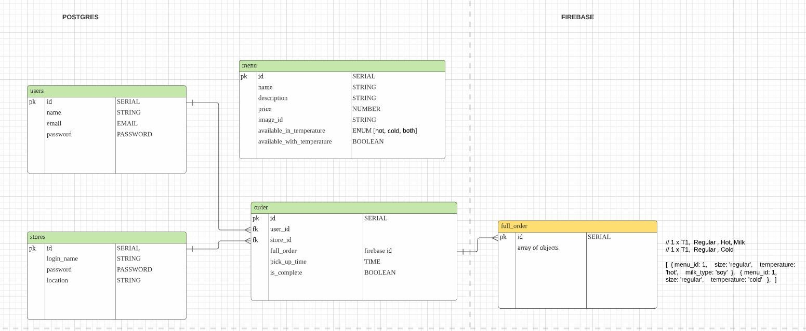

# Rocket Tea

### A tech enabled tea chain. Tea lovers can place an order for a cup of tea at the nearest outlet. Grabs his/her order on the go.

## ⚙️Technologies:

### Client-side:

- React

### Server-side

- Node.js/ Express
- PostgreSQL/ Sequelize ORM

### APIs

- Google maps location api

### Deployment

- Heroku

## User story

### Customer:

- Wants to buy a cup of tea / many teas as quick as possible and collect it near my location
- Wants to choose the pick up time
- Wants to customize my tea order
- Wants to know the status of my order
  - figure out where archived orders go

### Store:

- Wants to know what the order is
- Wants to know what time the pick up is
- Wants to mark order as done when customer has picked it up

### ERD

